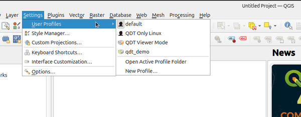

<div align="center">
  <a href="https://github.com/qgis-deployment/qgis-deployment-toolbelt-cli">
    
  </a>
</div>

# QGIS Deployment Toolbelt (QDT) YEAHHHHHHHHH

[](https://github.com/psf/black)
[](https://flake8.pycqa.org/)
[](https://pycqa.github.io/isort/)
[](https://github.com/pre-commit/pre-commit)
[](https://results.pre-commit.ci/latest/github/qgis-deployment/qgis-deployment-toolbelt-cli/main)
[](https://github.com/PyCQA/bandit)
[](https://sonarcloud.io/summary/new_code?id=Guts_qgis-deployment-cli)

[](https://github.com/qgis-deployment/qgis-deployment-toolbelt-cli/actions/workflows/tests.yml)
[](https://codecov.io/gh/qgis-deployment/qgis-deployment-toolbelt-cli)
[](https://github.com/qgis-deployment/qgis-deployment-toolbelt-cli/actions/workflows/build_release.yml)

[](https://pypi.org/project/qgis-deployment-toolbelt/)
[](https://pypi.org/project/qgis-deployment-toolbelt/)
[](https://pypi.org/project/qgis-deployment-toolbelt/)

**QGIS Deployment Toolbelt (QDT)** is a cross-platform (primarily Windows-focused) command-line tool that streamlines the deployment and management of **QGIS profiles**, **plugins**, and related settings within organizations.

It helps **standardize** user environments, **simplify** updates, and **integrate** with IT deployment strategies like **GPO**, **SCCM**, or **InTune**.

## ⭐ Why QDT?

- Save hours of manual QGIS configuration and profile management
- Reduce configuration errors and user friction
- Scale QGIS deployments in professional environments easily

## ✨ Features

- **Manage QGIS profiles easily**: define, store, and deploy profiles with a simple `profile.json` file.
- **Version control integration**: Git-powered backend for tracking changes and enabling collaborative profile management.
- **IT-friendly**: designed to work with Active Directory, GPOs, SCCM, InTune, and other enterprise tools.
- **Seamless user experience**: deliver a consistent QGIS experience across your organization with minimal friction.
- **Advanced configuration handling**: use variabilized `QGIS3.ini` files to handle dynamic or environment-specific settings.
- **Conditional deployments**: deploy specific profiles based on rules, environment variables, or user criteria.
- **Optimized plugin management** : reduce bandwidth usage by rationalizing plugin downloads and installations.

## 🚀 Try it quickly

You have multiple options to try QDT:

- Using Python and the official modern CLI installer [pipx](https://pipx.pypa.io/):

    ```sh
    pipx run qgis-deployment-toolbelt -s https://github.com/qgis-deployment/qgis-deployment-toolbelt-cli/raw/main/examples/scenarios/demo-scenario.qdt.yml
    ```

- Using Python and the official package installer `pip`:

    ```sh
    pip install qgis-deployment-toolbelt
    qdt -s https://github.com/qgis-deployment/qgis-deployment-toolbelt-cli/raw/main/examples/scenarios/demo-scenario.qdt.yml
    ```

- Using a pre-built executable (downloadable [through releases assets](https://github.com/qgis-deployment/qgis-deployment-toolbelt-cli/releases/latest)). For example on Windows:

    ```powershell
    ./Windows_QGISDeploymentToolbelt_0-37-0.exe  -s https://github.com/qgis-deployment/qgis-deployment-toolbelt-cli/raw/main/examples/scenarios/demo-scenario.qdt.yml
    ```

Once completed, check:

- The **Start menu** / **Desktop** for new shortcuts.
- The **QGIS Profiles menu** for new profiles.



Splash screen when launching the **Demo Profile**:


Splash screen for the **Viewer Profile**:


Have you tried it on Linux? Well, you should find an additional profile simply named "QDT Only Linux".

> [!TIP]
> **Interested**? For further details, [read the documentation](https://qgis-deployment.github.io/qgis-deployment-toolbelt-cli/) :books:.

## 🤝 Contribute

Want to help?

Check out the [contribution guide and "Development" section in the documentation](https://qgis-deployment.github.io/qgis-deployment-toolbelt-cli/development/contribute.html).
